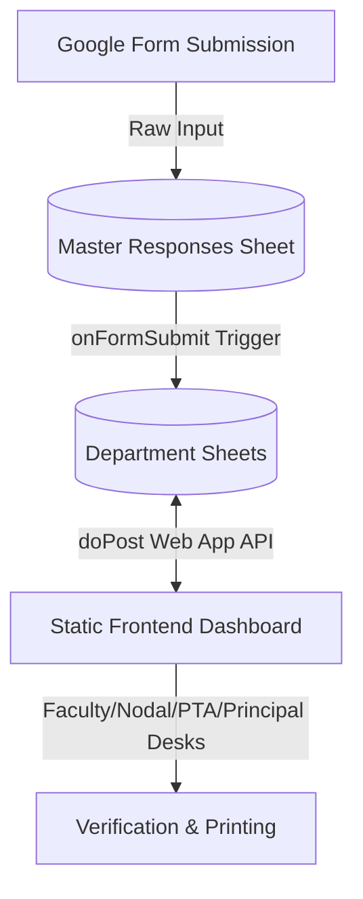

# GVC Admission & TC Clearance ERP System - Context & Architecture

This document serves as an architectural blueprint and handoff context for subsequent development or AI pairing sessions.

---

## 1. System Overview
The **Government Victoria College (GVC) Admission System** is a serverless, database-light ERP solution designed to handle student exit clearance and Transfer Certificate (TC) generation. It bridges Google Forms, Google Sheets, Google Apps Script, and a static frontend client.

---

## 2. Core Architecture

### A. Database Layer (Google Sheets)
* **`Master Responses`**: The landing sheet for all form submissions containing **43 custom fields** (Aadhaar, Parent Contacts, Certificate uploads).
* **Department Sheets (e.g., *Computer Science*, *Physics*)**: Named exactly after the college's departments. Form submissions are auto-routed here.
* **`Credentials`**: Stores passwords for administrative and department desks. Automatically self-heals/populates missing departments.
* **`PTA_Config`**: Holds default Welfare, Membership, and Donation fees per Program Type (*BA*, *B.Sc.*, *B.Com.*) for SC/ST and Non-SC/ST categories.
* **`Seat_Matrix`**: Maintains the maximum vacancy allocation (`Open`, `SC`, `ST`, `OBC`, `EWS`, `OEC`) dynamically configured by the Nodal Officer for each Department.

### B. Backend API Layer (`Code.gs`)
* **`onFormSubmit(e)`**: An installable Google Sheets trigger.
  * Listens for form submissions, identifies the target department using the `"Admission to the Department"` header.
  * Copies all 43 columns, appends workflow headers (`Current_Status`, `Token_Number`, `Admission_Number`, remarks, PTA details), and routes the row to the department-specific tab.
* **`doPost(e)`**: Serves as a CORS-compliant JSON API endpoint. Supports operations:
  * `getDepartmentsList`, `getDepartmentData`, `validateCredentials`, `updateStudentData`, `getPTAConfig`, `updatePTAConfig`, `getAllDepartmentsData`, `getSeatMatrix`, `updateSeatMatrix`.
* **`validateCredentials()`**: Checks role credentials. Safely synchronizes missing departments into the `Credentials` sheet without overwriting existing custom passwords.
* **Concurrency Control (`LockService`)**: Functions handling sensitive write-logic (like `updateStudentData`) are wrapped in `LockService.getScriptLock()` to queue exact-millisecond executions. This guarantees that sequentially generated tokens (e.g. `T-001`, `T-002`) remain perfectly unique under heavy 16-department concurrent loads.

### C. Frontend Dashboard (`index.html`)
* **Unified Workspace**: Served either as an Apps Script Web App or a standalone static page (e.g., GitHub Pages). If hosted externally, it emulates the Native Apps Script environment (`google.script.run`) using `fetch()` POST requests to the `webAppUrl` global variable.
* **Responsive Roles**:
  * **Faculty / Department Desk**: Unified role (1 login per department). Allocates students to available Seat Matrix slots. Generates universal sequential token numbers prefixed with `T-` (e.g., `T-001`).
  * **Nodal Officer**: Central audit desk. Configures the Seat Matrix quotas. Can revert profiles back to Faculty.
  * **PTA Desk**: Computes fees, issues half-page A5 landscape receipts.
  * **Principal**: Final authority. Assigns the Admission Number, decides the final TC Number, and sets the status to **`TC Issued`** (which visually turns red system-wide).
* **Cross-Desk Data Aggregation**: Central nodes (Nodal, PTA, Principal) automatically load all 1,000+ students across all 16 separate sheets simultaneously via a high-speed bulk `getValues()` payload, displaying a unified grid with a dedicated "Department" column.

---

## 3. Critical Workflows & Design Decisions

### A. Side-by-Side Landscape TC Printing
* **Constraint**: A4 paper must hold two identical Transfer Certificates side-by-side in landscape orientation (`@page { size: A4 landscape; }`).
* **Implementation**: Opens a new blank browser tab (`window.open`) and writes a self-contained, isolated HTML structure containing the two certificate elements.
* **Self-Contained Styling**: Does not import the main dashboard's dark-mode CSS to prevent color conflicts (e.g., white-on-white text). Forces text to solid black using `* { color: #000 !important; }`. 
* **Persistence**: The tab stays open (`printWindow.close()` is omitted) so the user has full control over re-printing or saving.

### B. Date Standardisation (`DD/MM/YYYY`)
* A frontend helper `formatDateToDDMMYYYY()` normalizes all date inputs (DOB, dates of leaving/application/issue) to standard British/Indian format. This ensures that:
  1. The dates match Google Sheets.
  2. Mismatched regional machine formats (like US `MM/DD/YYYY` vs Indian `DD/MM/YYYY`) do not break the verbal date compiler (`convertDateToWords()`) on printed TCs.

### C. PTA Calculator & Normalization
* Google Form outputs might contain `"B.A."` or `"B.Sc."` while the PTA settings config contains `"BA"` or `"B.Sc."`. A standardizer helper `normalizeProgType()` matches them case-insensitively and strips periods during fee computations to guarantee matching.

---

## 4. Maintenance & Handoff Checklist
* **Adding new departments**: Add them to the dropdowns in `index.html` and the `departmentsList` array in `Code.gs`. The `validateCredentials` sync will auto-create their sheet passwords.
* **Web App Updates**: Remember that Google Apps Script Web Apps run cached versions. When updating `Code.gs`, you must deploy a **New Deployment** (under *Deploy -> Manage Deployments*) or use the **Test Deployment URL** to see backend updates in real-time. Alternatively, run the manual helper function `syncCredentialsSheet` directly in the Apps Script Editor to force-sync.
